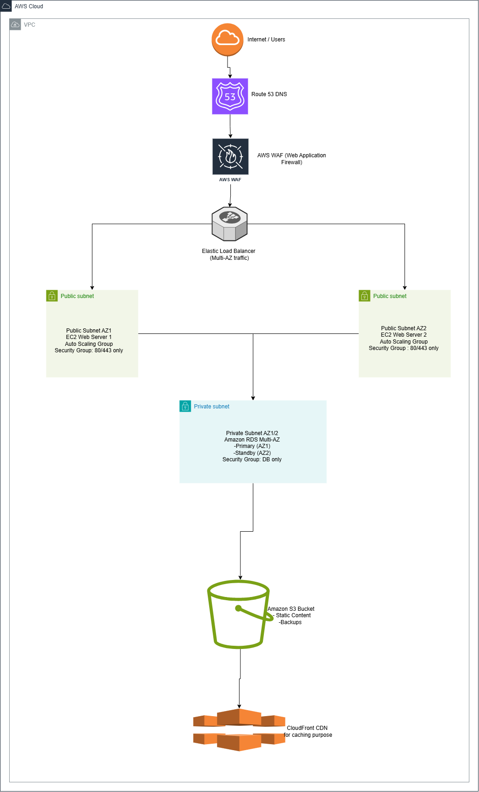

# **AWS Well-Architected & Cloud Adoption Framework Lab Solution**

---

## **Task 1 – Review the Existing Architecture**

**Workload Components:**

* **Frontend:** Web application hosted on a single on-premises server.
* **Backend:** Relational database (e.g., MySQL) on on-premises server.
* **Networking:** Single network, public IP, basic firewall rules.
* **Storage:** Local disk storage for database and static content.

**Potential Risks / Weaknesses:**

1. **No backup strategy:** Database and application data at risk.
2. **Single-AZ deployment:** No high availability, single point of failure.
3. **Open security groups/firewall:** Vulnerable to attacks.
4. **Manual scaling:** Unable to handle traffic spikes efficiently.
5. **No monitoring or logging:** Hard to detect failures or performance issues.

---

## **Task 2 – WAF Assessment Table**
| Pillar                 | Observation (Strength)        | Improvement Needed                         | Recommendation                                            | Supporting AWS Service                               |
| ---------------------- | ----------------------------- | ------------------------------------------ | --------------------------------------------------------- | ---------------------------------------------------- |
| Operational Excellence | Basic processes in place      | Limited monitoring and automation          | Implement automated deployment and monitoring             | AWS CloudWatch, AWS CloudTrail, AWS CodePipeline     |
| Security               | Existing firewall rules       | Open ports and no IAM enforcement          | Implement least-privilege access, secure endpoints        | AWS IAM, Security Groups, AWS WAF                    |
| Reliability            | Single server works currently | No redundancy; single AZ                   | Deploy multi-AZ architecture with failover                | Amazon RDS Multi-AZ, Elastic Load Balancer           |
| Performance Efficiency | Application works at low load | Cannot auto-scale with traffic             | Implement auto-scaling and optimized resource types       | Auto Scaling Groups, Amazon EC2, Amazon Aurora       |
| Cost Optimization      | Minimal on-prem costs         | Inefficient resource use; no cost tracking | Use right-sized instances, leverage reserved/spot pricing | AWS Cost Explorer, AWS Savings Plans, Spot Instances |

## **Task 3 – AWS Cloud Adoption Framework (CAF) Readiness Summary**

### **1. Business Perspective**

The company wants to move its two-tier web application to AWS to make it more scalable and reliable. While there’s a clear goal to get good value from the cloud, there aren’t specific measures to track success. **What to do:** Decide on key metrics like uptime, customer satisfaction, and cost savings, and make sure management supports the migration and aligns it with business goals.

### **2. People Perspective**

The staff know how to manage on-premises servers but have limited cloud experience. **What to do:** Provide training, hands-on labs, and cloud certification programs. Consider setting up a small “cloud team” (Cloud Center of Excellence) to guide and support everyone.

### **3. Governance Perspective**

Right now, there are no formal cloud rules or policies, and processes like compliance and change management are weak. **What to do:** Set up cloud governance rules, create budget limits, standardize resource tagging, and use AWS tools to monitor and audit activities.

### **4. Platform Perspective**

The current application runs on a single server and isn’t designed to scale. **What to do:** Redesign it to use multiple Availability Zones and managed AWS services like RDS, S3, ELB, and Auto Scaling so it performs better, is more reliable, and needs less manual management.

### **5. Security Perspective**

Security is basic: firewalls are open, and user access is not tightly controlled. **What to do:** Apply least-privilege access using IAM roles, encrypt data in transit and at rest, protect the web app with AWS WAF, and continuously monitor with AWS Security Hub and GuardDuty.

### **6. Operations Perspective**

Operations are mostly manual, and there’s no centralized monitoring or alerts. **What to do:** Use CloudWatch for monitoring and alerts, automate tasks with AWS Systems Manager, and set up automatic backups and recovery plans.

---
## **Task 4 – Improved Architecture Description**

**Proposed Architecture:**

* **Frontend (Web Tier):**

  * Amazon EC2 instances in an **Auto Scaling Group** across **multiple AZs**
  * **Elastic Load Balancer** to distribute traffic

* **Backend (Database Tier):**

  * Amazon RDS (MySQL or Aurora) **Multi-AZ deployment** for high availability
  * Automated **backups and snapshots** enabled

* **Storage & Static Content:**

  * Amazon S3 for static assets
  * Optional CloudFront CDN for global delivery

* **Security:**

  * IAM roles and policies for least-privilege access
  * Security Groups and NACLs to restrict traffic
  * AWS WAF to protect against common web exploits

* **Monitoring & Operations:**

  * AWS CloudWatch for metrics and alarms
  * AWS CloudTrail for audit logs
  * AWS Systems Manager for operational automation

* **Cost Optimization:**

  * Use right-sized EC2 instances, RDS reserved instances
  * Enable auto-scaling to reduce idle resources
  * Monitor with AWS Cost Explorer

**Architecture Diagram:**

---

## **Reflection**
This lab really showed me how important it is to **evaluate cloud workloads in a structured way** using AWS frameworks. Using the Well-Architected Framework helped me see what’s working well and what needs improvement in areas like operations, security, reliability, performance, and cost. I learned how services like **RDS Multi-AZ, Auto Scaling, and CloudWatch** can fix these weak points.The CAF analysis also made it clear that technical solutions alone aren’t enough—people, governance, and operations all matter. Designing the improved architecture taught me how to balance **best practices with real-world limitations**, making the system reliable, secure, and cost-efficient.
Overall, I now understand how cloud architects **analyze workloads, suggest improvements, and explain their decisions** clearly. This lab gave me practical experience in planning cloud migrations and showed the importance of looking at both technology and organizational readiness.

